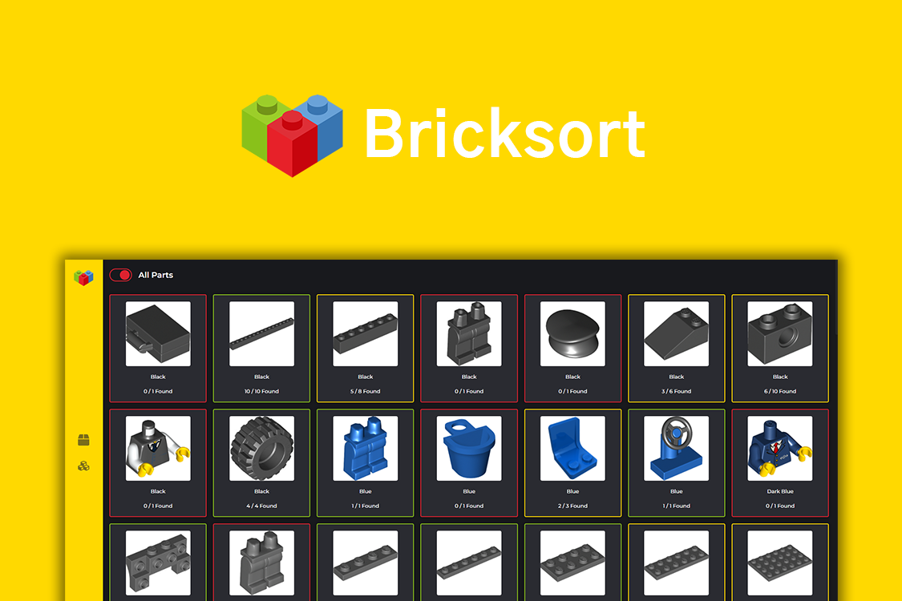

<h1 align="center">
  Bricksort
</h1>
<p align="center">
 An app to help you group your lego collection into sets, you can visit it at <a href="https://bricksort.co.uk" target="_blank">bricksort.co.uk</a>
</p>

<p align="center">
  <a href="https://app.netlify.com/sites/bricksort/deploys" target="_blank">
    
  </a>
</p>

## Installation

1. Install the required dependencies

   ```sh
   npm install
   ```

2. Start the development server

   ```sh
   npm run dev
   ```

## Building for production

1. Generate a production build

   ```sh
   npm run build
   ```

2. Start the server

   ```sh
   npm start
   ```
